# ☁️ AWS Képzés – Cloud Idézetek + AI Chatbot

Egy napos, gyakorlati AWS képzés. A nap végére egy **működő webalkalmazást** hozunk létre,
ami idézeteket jelenít meg adatbázisból és egy AI chatbotot is tartalmaz.

---

## 🏗️ Architektúra

```mermaid
graph LR
    Browser["👤 Böngésző"]
    EC2["🖥️ EC2<br/>Apache"]
    APIGW["🌐 API Gateway"]
    LambdaQ["⚡ Lambda<br/>quotes"]
    LambdaC["⚡ Lambda<br/>chat"]
    RDS["🗄️ RDS<br/>MySQL"]
    Bedrock["🤖 Bedrock<br/>Claude AI"]

    Browser --> EC2
    EC2 --> APIGW
    APIGW --> LambdaQ
    APIGW --> LambdaC
    LambdaQ --> RDS
    LambdaC --> Bedrock

    style Browser fill:#1e293b,stroke:#94a3b8,color:#f1f5f9
    style EC2 fill:#1e3a5f,stroke:#38bdf8,color:#f1f5f9
    style APIGW fill:#2d1b4e,stroke:#a78bfa,color:#f1f5f9
    style LambdaQ fill:#1a3636,stroke:#4ade80,color:#f1f5f9
    style LambdaC fill:#1a3636,stroke:#4ade80,color:#f1f5f9
    style RDS fill:#3b1f1f,stroke:#f97316,color:#f1f5f9
    style Bedrock fill:#3b1f3b,stroke:#f093fb,color:#f1f5f9
```



| Réteg     | AWS szolgáltatás    | Mappa                       |
| --------- | ------------------- | --------------------------- |
| Frontend  | EC2 + Apache        | `01-Webapp/`                |
| Backend   | Lambda (Python) × 2 | `02-Lambda/`                |
| Adatbázis | RDS MySQL           | `03-Database/`              |
| API       | API Gateway         | _(konzolban konfiguráljuk)_ |
| AI        | Amazon Bedrock      | _(konzolban konfiguráljuk)_ |

---

## 📁 Projekt struktúra

```
.
├── 01-Webapp/
│   ├── index.html
│   ├── css/
│   │   └── style.css
│   └── js/
│       ├── config.js          ← ⚠️ API URL beállítás
│       └── app.js
├── 02-Lambda/
│   ├── quotes/
│   │   └── lambda_handler.py  ← Idézetek API
│   └── chat/
│       └── lambda_handler.py  ← AI Chatbot
├── 03-Database/
│   └── init.sql               ← Tábla + 15 idézet
├── LICENSE
└── README.md                  ← Ez a fájl
```

---

## 🎯 Haladási terv

| #   | Lépés                             | Működik utána?              |
| --- | --------------------------------- | --------------------------- |
| 1   | EC2 + Apache + frontend feltöltés | ❌ (nincs backend)          |
| 2   | Lambda function-ök létrehozása    | ❌ (nincs API GW, nincs DB) |
| 3   | API Gateway + config.js frissítés | ❌ (nincs DB)               |
| 4   | RDS MySQL + Lambda env vars       | ✅ Idézetek működnek!       |
| 5   | Bedrock model access + IAM        | ✅ AI chatbot is működik!   |

---

## Előfeltételek

- AWS account (free tier elég)
- Régió: **eu-central-1** (Frankfurt)
- **DBeaver Community** (adatbázis kezeléshez) – https://dbeaver.io/download/

---

## 1. lépés – EC2 + Apache (frontend)

> 📂 Fájlok: `01-Webapp/`

### 1.1 EC2 instance indítása

AWS Console → **EC2** → **Launch instance**

| Beállítás                    | Érték                                 |
| ---------------------------- | ------------------------------------- |
| Name                         | `webapp-frontend`                     |
| AMI                          | **Amazon Linux 2023** (free tier)     |
| Instance type                | **t3.micro** (free tier)              |
| Key pair                     | Create new → `webapp-key` → Download! |
| Security group               | Create new                            |
| → SSH (22)                   | My IP (legbiztonságosabb)             |
| → HTTP (80)                  | **Anywhere** (0.0.0.0/0)              |
| Advanced details → User data | (lásd: 1.3 Apache telepítése)         |

### 1.2 Csatlakozás

EC2 → Instances → válaszd ki → **Connect** → **EC2 Instance Connect** → Connect

### 1.3 Apache telepítése

```bash
#!/bin/bash
sudo yum update -y
sudo yum install -y httpd
sudo systemctl start httpd
sudo systemctl enable httpd
```

Teszt: `http://EC2_PUBLIC_IP` → Apache tesztoldal jelenik meg.

### 1.4 Frontend feltöltése

A fájlokat közvetlenül a GitHub repóból töltjük le – így nincs kódolási probléma:

```bash
REPO="https://raw.githubusercontent.com/cloudsteak/trn-aws-workshop/Cmain/01-Webapp"

sudo mkdir -p /var/www/html/css /var/www/html/js

sudo curl -o /var/www/html/index.html      "$REPO/index.html"
sudo curl -o /var/www/html/css/style.css    "$REPO/css/style.css"
sudo curl -o /var/www/html/js/config.js     "$REPO/js/config.js"
sudo curl -o /var/www/html/js/app.js        "$REPO/js/app.js"
```

> ⚠️ Cseréld ki a `GITHUB_USER/REPO_NAME`-et a saját repódra!
> Ellenőrizd a létrejött fájlstruktúrát: `tree /var/www/html`

Teszt: `http://EC2_PUBLIC_IP` → Az oldal megjelenik. A health dashboard piros – ez normális, nincs backend még.

---

## 2. lépés – Lambda function-ök

> 📂 Fájlok: `02-Lambda/`

### 2.1 PyMySQL Layer készítése

A quotes Lambda-nak kell a `pymysql` csomag. Futtasd a repóban található scriptet
(Windows, Mac, Linux – mindenhol működik, csak Python kell):

```bash
python 02-Lambda/build_layer.py
```

Eredmény: `pymysql-layer.zip`

Lambda → **Layers** → Create layer → Name: `pymysql` → Upload: `pymysql-layer.zip` → Runtime: Python 3.12

### 2.2 Lambda #1: Idézetek API

1. Lambda → **Create function**
   - Name: `cloud-quotes-api`
   - Runtime: **Python 3.12**
2. Create function
3. Kód: másold be a `02-Lambda/quotes/lambda_handler.py` tartalmát
4. Deploy
5. Layers → **Add a layer** → Custom layers → `pymysql`
6. Configuration → **Environment variables**:

| Kulcs         | Érték                         |
| ------------- | ----------------------------- |
| `DB_HOST`     | ⏳ _A 4. lépésben kapjuk meg_ |
| `DB_USER`     | `admin`                       |
| `DB_PASSWORD` | ⏳ _A 4. lépésben adjuk meg_  |
| `DB_NAME`     | `cloudquotes`                 |

7. Configuration → General → **Timeout**: 30 sec

### 2.3 Lambda #2: AI Chatbot

1. Lambda → **Create function**
   - Name: `cloud-chat-api`
   - Runtime: **Python 3.12**
2. Create function
3. Kód: másold be a `02-Lambda/chat/lambda_handler.py` tartalmát
4. **NEM kell Layer** – a boto3 alapból elérhető
5. **NEM kell VPC** – a Bedrock publikus endpoint
6. **Timeout**: 30 sec
7. IAM: ⏳ _Az 5. lépésben adjuk hozzá_

---

## 3. lépés – API Gateway

> _(Nincs kódfájl – a konzolban konfiguráljuk)_

### 3.1 API létrehozása

API Gateway → Create API → **REST API** → Name: `cloud-quotes`

### 3.2 Végpontok

Azoknál a methodoknál, ahol a Lambda függvényt hozzárendeljük, ott kapcsold be a **Lambda Proxy integration**-t – így a Lambda teljes request/response objektumot kap, és mi döntjük el mit csinálunk vele.

| Resource         | Method | Lambda function    | Proxy |
| ---------------- | ------ | ------------------ | ----- |
| `/quotes`        | GET    | `cloud-quotes-api` | ✅    |
| `/quotes/random` | GET    | `cloud-quotes-api` | ✅    |
| `/quotes/health` | GET    | `cloud-quotes-api` | ✅    |
| `/chat`          | POST   | `cloud-chat-api`   | ✅    |
| `/chat/health`   | GET    | `cloud-chat-api`   | ✅    |

Lépések:

1. Resources → Create resource → `quotes` → Create method → GET → Lambda Proxy → `cloud-quotes-api`
2. `/quotes` → Create resource → `random` → Create method → GET → Lambda Proxy → `cloud-quotes-api`
3. `/quotes` → Create resource → `health` → Create method → GET → Lambda Proxy → `cloud-quotes-api`
4. Root `/` → Create resource → `chat` → Create method → POST → Lambda Proxy → `cloud-chat-api`
5. `/chat` → Create resource → `health` → Create method → GET → Lambda Proxy → `cloud-chat-api`

### 3.3 CORS engedélyezése

⚠️ Minden resource-ra: kiválasztod → **Enable CORS** → `*` → Enable

### 3.4 Deploy

Deploy API → Create new stage → `prod` → Deploy

📋 Jegyezd fel az **Invoke URL**-t!

### 3.5 ⚠️ Vissza az EC2-re: config.js frissítése

```bash
sudo nano /var/www/html/js/config.js
```

Cseréld ki az `XXXXXXXXXX`-et:

```javascript
API_BASE_URL: 'https://abc123xyz.execute-api.eu-central-1.amazonaws.com/prod',
```

---

## 4. lépés – RDS MySQL adatbázis

> 📂 Fájlok: `03-Database/`

### 4.1 RDS instance létrehozása

AWS Console → **RDS** → Create database

| Beállítás              | Érték                             |
| ---------------------- | --------------------------------- |
| Engine                 | **MySQL** 8.0                     |
| Template               | **Free tier** ✅                  |
| DB instance identifier | `quotes-db`                       |
| Master username        | `admin`                           |
| Master password        | Válassz egyet és **jegyezd meg!** |
| DB instance class      | `db.t4g.micro`                    |
| Storage                | 20 GB                             |
| Public access          | **Yes** ⚠️ (csak képzéshez!)      |
| Security group         | Create new → `quotes-db-sg`       |
| Initial database name  | `cloudquotes`                     |

Create database → Várj 5-10 percet.

### 4.2 Security Group

EC2 → Security Groups → `quotes-db-sg` → Inbound → Edit:

- Type: **MySQL/Aurora** (3306) → Source: **Anywhere** ⚠️

### 4.3 Csatlakozás DBeaver-rel

📋 Jegyezd fel az RDS **Endpoint**-ot: RDS → Databases → `quotes-db` → Connectivity & security.

#### DBeaver connection beállítása

1. DBeaver → **New Database Connection** → MySQL
2. **Main tab**:

| Mező        | Érték                                            |
| ----------- | ------------------------------------------------ |
| Server Host | `quotes-db.xxxxx.eu-central-1.rds.amazonaws.com` |
| Port        | `3306`                                           |
| Database    | `cloudquotes`                                    |
| Username    | `admin`                                          |
| Password    | a te jelszavad                                   |

3. **SSL tab** – kötelező az RDS-hez:

| Beállítás                 | Érték               |
| ------------------------- | ------------------- |
| Use SSL                   | ✅                  |
| Require SSL               | ✅                  |
| Verify server certificate | ✅                  |
| CA Certificate            | `global-bundle.pem` |

A CA tanúsítványt töltsd le innen:

```
https://truststore.pki.rds.amazonaws.com/global/global-bundle.pem
```

4. **Test Connection** → Ha zöld, minden rendben!

### 4.4 SQL futtatása DBeaver-ben

1. A bal oldali fa struktúrában kattints a `cloudquotes` adatbázisra
2. **Jobb klikk** → **SQL Editor** → **Open SQL Script**
3. Nyisd meg az `03-Database/init.sql` fájlt (File → Open File, vagy másold be a tartalmát)
4. **Fontos**: az editor tetején ellenőrizd, hogy a `cloudquotes` adatbázis van kiválasztva!
5. **Execute** (▶️ gomb vagy Ctrl+Enter) – az összes parancs lefut
6. Ellenőrzés: a Results panelen látod a kategóriánkénti darabszámot (5-5-5)

### 4.5 ⚠️ Vissza a Lambda-hoz: environment variables

Lambda → `cloud-quotes-api` → Configuration → Environment variables:

| Kulcs         | Érték                                            |
| ------------- | ------------------------------------------------ |
| `DB_HOST`     | `quotes-db.xxxxx.eu-central-1.rds.amazonaws.com` |
| `DB_USER`     | `admin`                                          |
| `DB_PASSWORD` | a te jelszavad                                   |
| `DB_NAME`     | `cloudquotes`                                    |

### 4.6 Tesztelés

Nyisd meg a webapp-ot a böngészőben: `http://EC2_PUBLIC_IP`

🎉 **Az idézetek megjelennek!** A health dashboard-on a Lambda (quotes) és RDS zöldre vált.

---

## 5. lépés – AI Chatbot (Amazon Bedrock)

> _(Nincs kódfájl – a Lambda kód a 2. lépésben már felkerült)_

### 5.1 Model access engedélyezése

1. **Amazon Bedrock** → **Model catalog** (a bal oldali menüben)
2. Keresés: **Anthropic** → **Claude 3 Haiku**
3. **Request model access** → Enable

> ⚠️ Az Anthropic első használatkor megköveteli a use case leírását:
> _"Anthropic requires first-time customers to submit use case details before invoking a model,
> once per account or once at the organization's management account."_
>
> Kattints a **Submit use case details** gombra és töltsd ki a rövid kérdőívet.
> Az információ az Anthropic-kal lesz megosztva. Ez egyszer kell, utána az összes Anthropic modell elérhető.

### 5.2 IAM jogosultság a chat Lambda-hoz

1. Lambda → `cloud-chat-api` → Configuration → Permissions → kattints a **Role name**-re
2. IAM → **Add permissions** → **Attach policies**
3. Keresés: `AmazonBedrockFullAccess` → Add

Vagy minimális policy:

```json
{
  "Version": "2012-10-17",
  "Statement": [
    {
      "Effect": "Allow",
      "Action": "bedrock:InvokeModel",
      "Resource": "arn:aws:bedrock:eu-central-1::foundation-model/anthropic.claude-3-haiku-20240307-v1:0"
    }
  ]
}
```

### 5.3 Tesztelés

Nyisd meg a webapp-ot: `http://EC2_PUBLIC_IP` → jobb alsó sarok 🤖 → kérdezz valamit!

🎉 **Az AI válaszol!** A health dashboard-on a Bedrock is zöldre vált.

> 💡 **Megjegyzés**: A chatbotnak nincs memóriája – minden üzenet független kérés a Bedrock felé.
> Memóriát (konverzáció-előzmények) DynamoDB-vel lehetne implementálni, de a cél most az volt,
> hogy lássuk milyen **egyszerű egy AI chatbotot összerakni** AWS-en.

---

## 🎉 Kész!

A teljes alkalmazás működik:

```
Idézetek:  Böngésző → EC2 Apache → API GW → Lambda → RDS MySQL
AI Chat:   Böngésző → EC2 Apache → API GW → Lambda → Bedrock Claude
```

---

## Takarítás (Erőforrások eltávolítása és törlése a képzés után!)

1. **EC2**: Terminate instance
2. **RDS**: Delete database (skip final snapshot)
3. **Lambda**: Delete mindkét function + pymysql layer
4. **API Gateway**: Delete API
5. **Security Groups**: Töröld az egyedieket

---

## ❓ Gyakori problémák

| Probléma                | Megoldás                                                            |
| ----------------------- | ------------------------------------------------------------------- |
| Lambda timeout (quotes) | RDS Public access bekapcsolva? Security Group 3306 nyitva?          |
| CORS hiba böngészőben   | API GW → Enable CORS mindenhol → Deploy újra                        |
| RDS connection refused  | Security Group 3306 port nyitva?                                    |
| DBeaver SSL hiba        | CA Certificate beállítva? `global-bundle.pem` letöltve?             |
| Bedrock access denied   | Model access engedélyezve? IAM policy hozzáadva? Use case kitöltve? |
| Webapp nem tölt be      | Ellenőrizd a `js/config.js` API URL-t                               |
| Apache nem indul        | `sudo systemctl status httpd`                                       |

---

## 💰 Költségek

| Szolgáltatás     | Free tier      | Becsült költség |
| ---------------- | -------------- | --------------- |
| EC2 t3.micro     | ✅ 12 hó       | $0              |
| RDS db.t4g.micro | ✅ 12 hó       | $0              |
| Lambda           | ✅ 1M kérés/hó | $0              |
| API Gateway      | ✅ 1M kérés/hó | $0              |
| Bedrock Haiku    | ❌ Pay-per-use | ~$0.01–0.05     |
